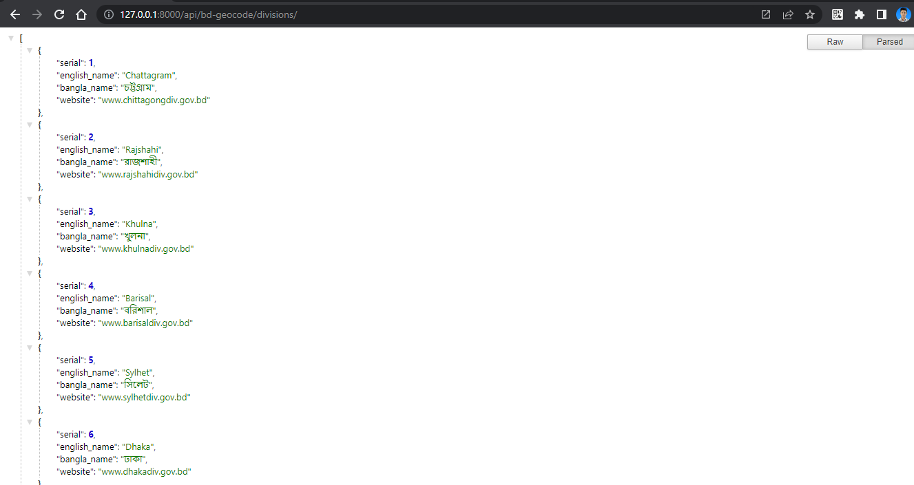
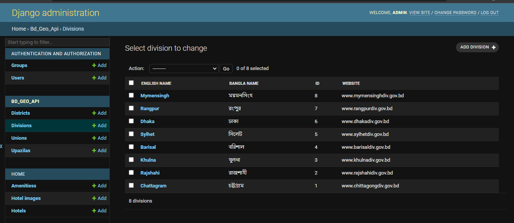
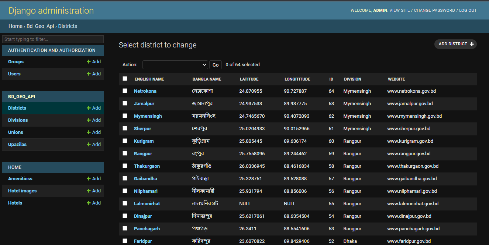
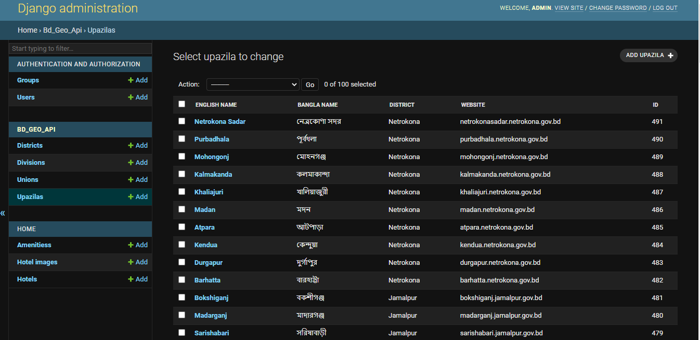
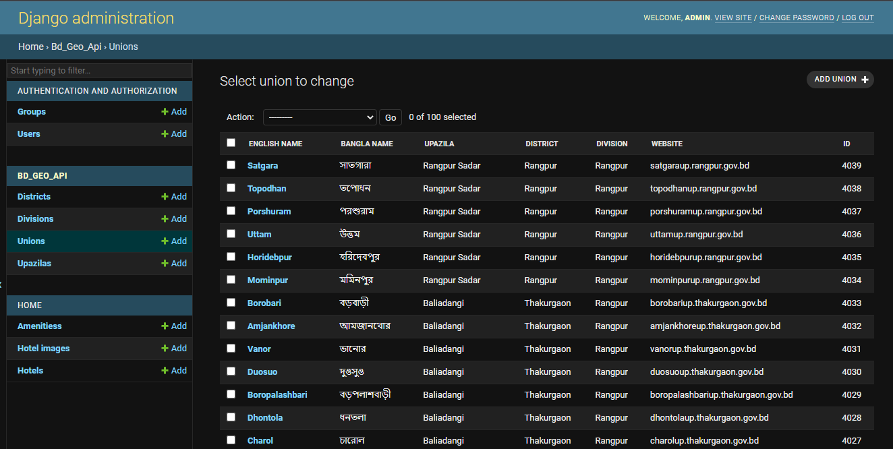

BD GeoCode DJango App
======================
### Required
>- python3 
> - Django3

**Division**, **District**, **Upazila** and, **Union** db table  

#### Currently has following columns
#### Division Table 
>- Bangla,English Name & Website Link

#### District mapped with Division 
>- Bangla,English Name & Website Link
>- (DC) office - latitude,longitude (3 meter accuracy)
   
#### Upazila mapped with District
>- Bangla,English Name & Website Link

#### Union mapped with Upazila
>- Bangla,English Name & Website Link

1.     pip install -r requirements.txt 

###  project/settings.py
2.     INSTALLED_APPS = [
           ....
            "corsheaders",
            'rest_framework',
            'geo_bd_api',
            ...
        ]  

3.     MIDDLEWARE = [
            ...
            "corsheaders.middleware.CorsMiddleware",
            'django.middleware.common.CommonMiddleware',
        
        ] 
4.     CORS_ALLOWED_ORIGINS = [
            "http://example.com",    
        ]

5.     REST_FRAMEWORK = {
        'DEFAULT_RENDERER_CLASSES': [
            'rest_framework.renderers.JSONRenderer',      
            ]
        }

6.     python manage.py makemigrations
7.     python manage.py migrate
       Do you want to create Division/District/Upazila/Union,default=NO. TYPE Y/N or yes/no? y and enter 
        Divistion creating...
         █████████████████████████| 8/8 [100%]|
        ✔ Done
        District creating...
         █████████████████████████| 64/64[100%]
        ✔ Done
        Upazila creating...
         █████████████████████████| 491/491 [100%]
        ✔ Done
        Union creating...
         █████████████████████████| 4540/4540  [100%]
        ✔ Done

####  project/urls.py

8.     path("api/geo-bd/",include("geo_bd_api.urls",namespace="geo_bd_api")),
9.     python manage.py runserver

### Router endpoints:
>- Route - > baseUrl/divisions/

>-  Route - > baseUrl/districts/${division_id}/

>-  Route - > baseUrl/upazila/${district_id}/

>- Route - > baseUrl/unions/${upazila_id}/
### API Response demo 

### App Admin Demo 
===============
##### Division Admin 

##### District Admin 

##### Upazila Admin 

##### Union Admin 

--done---